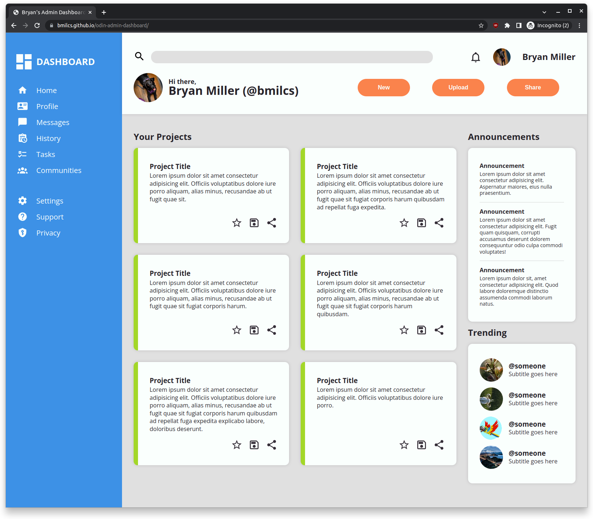
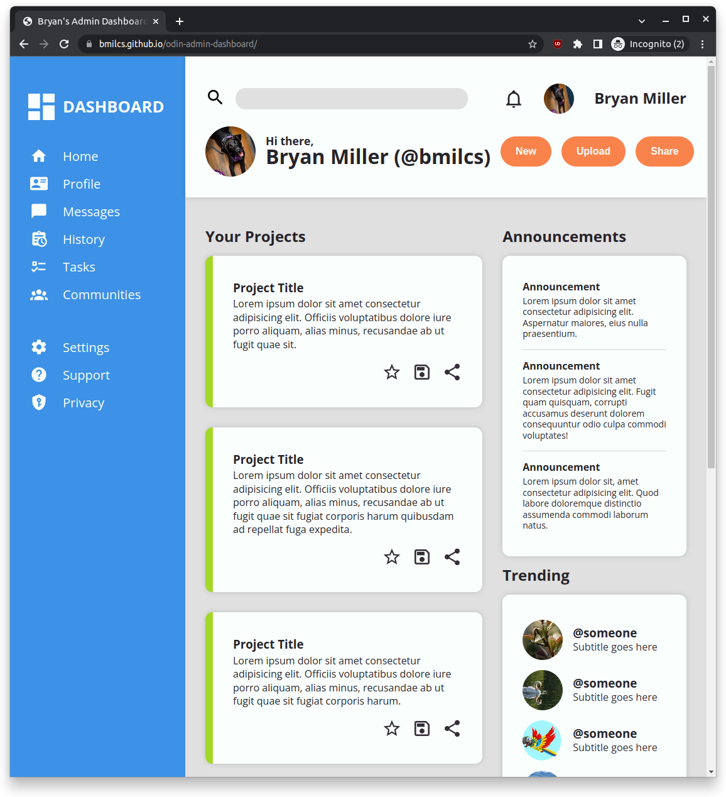
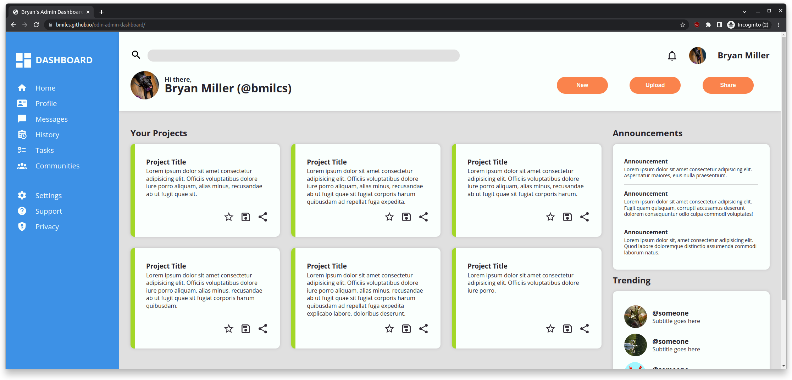

# Odin Project #7: Admin Dashboard

Welcome to Bryan Miller's Admin Dashboard Project, the [seventh assignment](https://www.theodinproject.com/lessons/node-path-intermediate-html-and-css-admin-dashboard) within the Odin Project curriculum. The goal of this repo is to practice the following skill sets:

- HTML
  - Semantic tags: `<section>` `<nav>` `<aside>` `<main>` `<header>` `<article>`
- SCSS
  - Nesting, `&`
  - Pseudo-element `:before` (dividers in the announcements section)
  - **Grid**: primary objective of this project
    - `grid-template-columns` & `grid-template-rows`
    - `grid-areas`
    - `grid-auto-rows`
    - Alignment: `justify-content`, `align-items`, `align-self`
  - CSS Functions: `min`, `minmax` (Grid only), `clamp`
  - Basic CSS reset
- Chrome DevTools & Debugging
- Git Fundamentals

## Summary

CSS Grid was the focus of this project and it does NOT disappoint. The `grid-template-columns: repeat(auto-fit, minmax(x, x))` property/value combination is MAGICAL, allowing us to create responsive designs without media queries or JavaScript.

I struggled with structuring and stylizing the main section of the page: the Your Projects, Announcements & Trending sections. My first approach involved a parent grid containing those 3 sections but the spacing & responsiveness did not work out as intended. Instead, I simplified it into a grid containing 2 sections: `<section>` for projects and `<aside>` for the Announcements and Trending. By combining the Announcements and Trending sections, I was able to keep consistent spacing between them as a user reduces the viewport width.

In addition to Grid, I also experimented with SASS, a CSS pre-processor, for the first time. Nesting alone makes it a worthy addition to any project until CSS natively supports it.

## Links

- [Live Demo](https://bmilcs.github.io/odin-admin-dashboard/)
- [My Odin Project Progress](https://github.com/bmilcs/odin-project)

## Screenshots

> Normal View



> Narrow View



> Wide View



## Deployment

```sh
git clone https://github.com/bmilcs/odin-admin-dashboard
```
